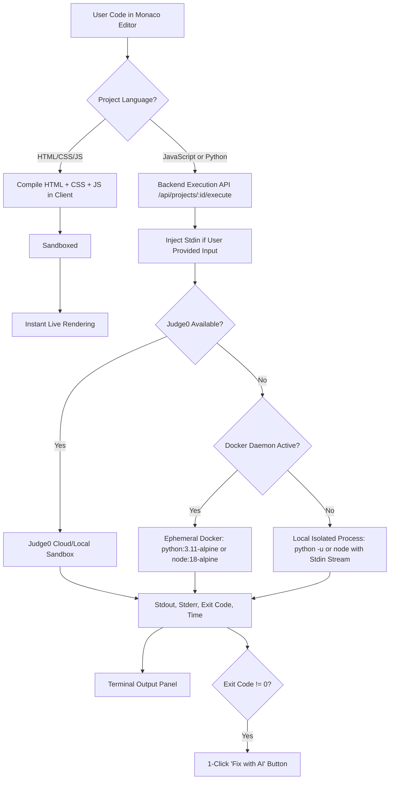

# CodeNest Compilation & Language Runtime Architecture

This document details the compilation, sandboxing, and execution architecture of **CodeNest**, as well as the step-by-step developer guide for adding support for new programming languages in future versions.

---

## 1. Supported Languages & Runtime Architecture

CodeNest strictly supports three primary workflows tailored for developers and students:

| Workflow | Language Key | Execution Engine | Isolation / Sandboxing | Starter Files |
| :--- | :--- | :--- | :--- | :--- |
| **Web Projects** | `HTML/CSS/JS` | In-Browser `<iframe>` sandbox (`srcDoc`) | Client-side isolated browsing context with `sandbox="allow-scripts"` | `index.html`, `style.css`, `script.js` |
| **JavaScript Scripting** | `JavaScript` | Standalone Node.js Engine | Lightweight Docker container (`node:18-alpine`) or Judge0 Language ID `63` | `index.js` |
| **Python Programming** | `Python` | Python 3.11 Interpreter | Ephemeral Docker container (`python:3.11-alpine`) or Judge0 Language ID `71` | `main.py` |

---

## 2. Execution Pipeline



### A. Web Project (`HTML/CSS/JS`)
- **Bundle Strategy:** The HTML file is combined dynamically with sibling `.css` and `.js` files in the workspace. `<style>` tags are injected into `<head>`, and `<script>` tags are appended before `</body>`.
- **Security:** Rendered inside `<iframe sandbox="allow-scripts">` to prevent cross-origin script leakage or cookie theft while allowing interactive DOM scripts, Canvas, and Web APIs.
- **Latency:** ~0ms (runs instantly in the user's browser, completely offline-compatible and token-free).

### B. Standalone JavaScript (`Node.js`)
- **Execution:** Dispatched to an ephemeral `node:18-alpine` container with memory capped at 128MB and CPU capped at 0.5 cores.
- **Judge0:** Maps to Judge0 Language ID `63` (JavaScript / Node.js 12+).
- **Timeout:** Maximum 10 seconds execution limit to prevent infinite loops (`while(true)`).

### C. Python (`Python 3.11`)
- **Execution:** Dispatched to `python:3.11-alpine` container with buffered output disabled (`python -u`).
- **Judge0:** Maps to Judge0 Language ID `71` (Python 3.8.1+ / 3.11).
- **Error Diagnosis Integration:** When Python exits with non-zero exit codes (e.g. `ZeroDivisionError`, `IndexError`, `TypeError`, `SyntaxError`), the IDE displays a dedicated "Fix with AI" action. The backend analyzes the traceback with a token-capped prompt (`maxOutputTokens: 350`) or instant rule-based fallback, providing exact line-by-line replacement.

---

## 3. Storage Optimization & C: Drive Protection

To prevent storage bloat on developer workstations:
1. **Removed Heavy Toolchains:** Legacy C/C++ (`gcc:latest`, ~1.4 GB) and Java (`eclipse-temurin:17`, ~450 MB) images and build directories have been completely purged from the Docker service layer.
2. **Alpine Base Images:** All active containers strictly use Alpine Linux variants:
   - `python:3.11-alpine`: ~52 MB
   - `node:18-alpine`: ~54 MB
3. **Ephemeral Containers:** Containers run with `--rm --read-only --tmpfs /tmp:rw,noexec,nosuid,size=32m`, ensuring no leftover containers, log files, or dangling layers fill the disk.

---

## 4. Developer Guide: Adding Future Languages

When the team decides to add a new language (e.g., Rust, Go, TypeScript), follow this systematic 6-step checklist:

### Step 1: Docker Container Definition (`backend/docker/`)
1. Create a minimal Dockerfile using an Alpine base image:
   ```dockerfile
   # Example: backend/docker/<language>/Dockerfile
   FROM <language>:<version>-alpine
   RUN addgroup -S runner && adduser -S runner -G runner
   WORKDIR /app
   USER runner
   CMD ["<compiler-or-interpreter>", "--version"]
   ```
2. Verify image footprint is under 100 MB before pushing to production registries.

### Step 2: Judge0 Language Mapping (`backend/src/services/execution.ts`)
Add the official Judge0 language ID to the dictionary:
```typescript
const JUDGE0_LANG_IDS: Record<string, number> = {
  javascript: 63,
  python: 71,
  // Add new mapping:
  // rust: 73,
  // go: 60
}
```

### Step 3: Backend Routes & File Templates (`backend/src/routes/projects.ts`)
1. Add the language to `ALLOWED_LANGUAGES`:
   ```typescript
   const ALLOWED_LANGUAGES = ['HTML/CSS/JS', 'JavaScript', 'Python', '<NewLanguage>']
   ```
2. Define standard starter files in project initialization:
   ```typescript
   if (language === '<NewLanguage>') {
     starterFiles = [
       { name: 'main.<ext>', path: 'main.<ext>', language: '<newlang>', content: '...' }
     ]
   }
   ```
3. Update `languageMap` in `backend/src/routes/projects.ts` to map file extensions (`.<ext>`) to the Monaco identifier.

### Step 4: Token-Optimized AI Error Diagnosis (`backend/src/services/gemini.ts`)
1. Add regex error extractors in `diagnoseError()` to catch runtime stack traces and line numbers for the new language.
2. Add rule-based fallback diagnostics in `generateLocalDiagnosis()` so users receive instant, zero-token feedback even when offline or when API limits are reached.

### Step 5: Frontend Editor & Monaco Configuration (`frontend/src/`)
1. In `frontend/src/services/playground.ts` and `frontend/src/pages/Dashboard.tsx`, add the language to options lists.
2. In `frontend/src/pages/ProjectWorkspace.tsx`, map the extension to Monaco's syntax highlighter in `fileLanguage()`.
3. In `frontend/src/pages/ProjectWorkspace.css`, customize language badges if needed.

### Step 6: Verification & Test Checklist
- [ ] Run code successfully with standard `stdout` assertion.
- [ ] Verify standard error capture and exit code propagation.
- [ ] Induce an intentional syntax error and confirm that the "Fix with AI (Token-Optimized)" button renders and returns actionable fixes.
- [ ] Test multi-user real-time collaboration with simultaneous cursors and auto-save enabled.
